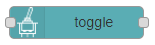
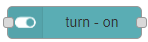
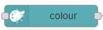
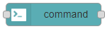
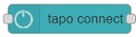

# node-red-contrib-tplink-tapo-connect-api

Unofficial node-RED node for connecting to TP-Link Tapo devices. Currently limited to the P100 & P105 smart plugs and L510E smart bulbs.


## nodes

- toggle

    

    This node module provides the ability to toggle (on / off) the power of tapo smart plugs.

- turn-on

    

    This node module provides the ability to power on tapo smart plugs.

- turn-off

    

    This node module provides the ability to power off tapo smart plugs.

- brightness

    

    This node module provides the ability to set the brightness of tapo smart bulbs.

- colour

    

    This node module provides the ability to set the color of tapo smart bulbs.

- command

    

    This node module provides several features by input `"msg.payload.command"`.

    1. power

        tapo device power on/off

        `msg.payload.option`

        ```cmd
        0: tapo device power off
        1: tapo device power on
        ```

    2. toggle

        tapo device power on/off(toggle)

    3. status

        get tapo device info

- status

    

    This node module provides the ability to get the device infomation of tapo smart plugs.

    Get the device information from `"output: msg.payload.tapoDeviceInfo"`.

- tplink_tapo_connect_api(`deprecated`)

    

    This "node module: tplink_tapo_connect_api" has been left for compatibility, this module may be deleted without notice.

## Pre-requisites

The node-red-contrib-tplink-tapo-connect-api requires `Node-RED 1.00` to be installed.

## Install

```cmd
npm install node-red-contrib-tplink-tapo-connect-api
```

## Usage

- Properties

  

  - Name

    Set the node name displayed in the flow.

  - Email

    Set the email address registered with Tp Link.

  - Password

    Set the password registered with Tp Link.

  - Search mode

    Select a search mode for the tapo device.

    [Usage]
    - ip : search by ip. (It's fast.)
    - alias: search by alias and ip range.

  - Tapo ipaddress(`selected: ip`)

    Set the IP address to the Tapo device.

  - Tapo alias(`selected: alias`)

    set the tapo device alias registered with Tp Link.

  - Tapo find ip range(`selected: alias`)

    set the IP range to search for Tapo device.

    [Usage]
    - case1: "192.168.0.1 to 192.168.0.25"
    - case2: "192.168.0.0/24"

### Inputs

`msg.payload`

```typescript
type searchModeTypes = "ip" | "alias";
type commandTypes = "" | "power" | "toggle" | "status";

type payload {
    email: string;
    password: string;
    deviceIp: string;
    deviceAlias: string;
    deviceIpRange: string;
    searchMode : searchModeTypes;
    command: commandTypes;          /* "node-command" only */
    option: {                       /* "node-command" only */
        power?: number;
    };
    colour: string;                 /* "node-colour" only */
    brightness: numbar;             /* "node-brightness" only */
}
```

[example1]

```json
msg = {
  "email": "your@gmail.com",
  "password": "password",
  "deviceIp": "192.168.0.xxx",
  "command": "power",
  "option": {
    "power": 0
  }
}
```

[example2]

```json
msg = {
  "email": "your@gmail.com",
  "password": "password",
  "deviceIp": "192.168.0.xxx",
  "command": "toggle"
}
```

### Outputs

The processing result is passed by msg.payload. It consists of an object that contains the following properties:

```typescript
type tapoConnectResults = {
    result: boolean; /* true: success, false: failure */
    tapoDeviceInfo?: tapoDeviceInfo; /* smart plug device infomation */
    errorInf?: Error;
}
```

[smart plug device infomation]

You can tell if the device is on or off by getting "device_on".

```text
true: smart plug power on
false: smart plug power off
```

```javascript
{
    result: true,
    tapoDeviceInfo: {
    device_id: "*************"
    fw_ver: "1.2.10 Build 20200609 Rel. 33394"
    hw_ver: "1.0.0"
    type: "SMART.TAPOPLUG"
    model: "P105"
    mac: "XX-XX-XX-XX-XX-XX"
    hw_id: "*************"
    fw_id: "*************"
    oem_id: "*************"
    specs: "JP"
    device_on: false
    on_time: 0
    overheated: false
    nickname: "3d printer power supply"
    location: "XXXXXXXXXXXXXXXX"
    avatar: "plug"
    time_usage_today: 0
    time_usage_past7: 0
    time_usage_past30: 0
    longitude: 0
    latitude: 0
    has_set_location_info: true
    ip: "192.168.0.XXX"
    ssid: "SSID"
    signal_level: 0
    rssi: 0
    region: "Asia/Tokyo"
    time_diff: 0
    lang: "ja_JP"
    }
}
```

## npm-scripts

There are some npm-scripts to help developments.

- npm install - Install the testing environment in your project.
- npm run build - Make `./data/my-node` directory from the `src` directory and Install the my-node in Node-RED.
- npm run start - Start Node-RED. `"http://localhost:1880"`

## file list

  ```json
  [root]
  │  package.json
  │  README.md
  │  tsconfig.json
  │
  ├─data -> `Node-Red work files`
  │  │  
  │  ├─my-node -> `project files` The resource files and built files should be placed here.
  │  │  │  package.json
  │  │  │
  │  │  └─nodes -> The resource files and built files should be placed here.
  │  │     └─...
  │  │
  │  └─node_modules
  │     └─...
  │
  ├─dist -> `The project built files`
  ├─examples -> `node-RED flow files`
  ├─figs
  └─src
      └─nodes -> project files
          ├─icons
          ├─lib
          ├─locales
          │  ├─en-US
          │  └─ja
          └─test
  ```
