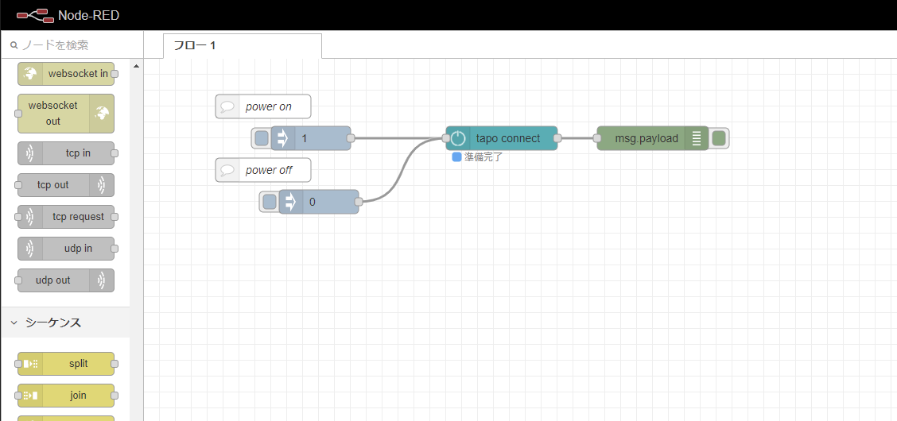
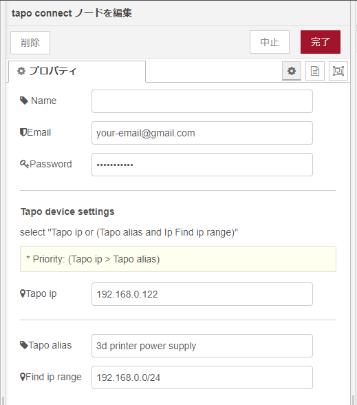

# node-red-contrib-tplink-tapo-connect-api

Unofficial node-RED node for connecting to TP-Link Tapo devices. Currently limited to the P105 smart plugs.



## Pre-requisites

The node-red-contrib-tplink-tapo-connect-api requires `Node-RED 1.00` to be installed.

## Install

This `node-red-contrib-tplink-tapo-connect-api` is implemented according to the `dickydoouk
/tp-link-tapo-connect` specification.

See "[dickydoouk/tp-link-tapo-connect](https://github.com/dickydoouk/tp-link-tapo-connect)" for details

```cmd
npm install node-red-contrib-tplink-tapo-connect-api
```

## Usage

- Properties

  

  - Name

    Set the node name displayed in the flow.

  - Email

    set the email address registered with Tp Link.

  - Password

    set the password registered with Tp Link.

  - Tapo ip

    set the IP address to the Tapo device.

    *This setting chooses either `Tapo ip` or `Tapo alias and Ip Find ip rang`.

    *Priority: `(Tapo ip > Tapo alias)`

  - Tapo alias

    set the tapo device alias registered with Tp Link.

  - Find ip range

    set the IP range to search for Tapo device.

    [Usage]

    - case1: "192.168.0.1 to 192.168.0.25"

    - case2: "192.168.0.0/24"

- Inputs

    1) payload: numbar `*required`

        set ON/OFF of the smart plug.

        ```json
        0: power off
        1: power on
        ```

- Outputs

    The processing result is passed by msg.payload. It consists of an object that contains the following properties:

    ```javascript
    type tapoConnectResults = {
        result: boolean; /* true: success, false: failure */
        errorInf?: Error;
    }
    ```

- example

    ```json
    [{"id":"35250d14.0fb0b2","type":"tab","label":"example-1","disabled":false,"info":""},{"id":"fb493813.249f08","type":"tplink_tapo_connect_api","z":"35250d14.0fb0b2","name":"","email":"your-email@gmail.com","password":"password","deviceIp":"192.168.0.100","deviceAlias":"3d printer power supply","deviceIpRange":"192.168.0.0/24","x":570,"y":140,"wires":[["2aa38c09.564724"]]},{"id":"8311f395.25e56","type":"inject","z":"35250d14.0fb0b2","name":"","props":[{"p":"payload"},{"p":"topic","vt":"str"}],"repeat":"","crontab":"","once":false,"onceDelay":0.1,"topic":"","payload":"1","payloadType":"num","x":310,"y":140,"wires":[["fb493813.249f08"]]},{"id":"2aa38c09.564724","type":"debug","z":"35250d14.0fb0b2","name":"","active":true,"tosidebar":true,"console":false,"tostatus":false,"complete":"false","statusVal":"","statusType":"auto","x":790,"y":140,"wires":[]},{"id":"9158e6ef.dd5d78","type":"inject","z":"35250d14.0fb0b2","name":"","props":[{"p":"payload"},{"p":"topic","vt":"str"}],"repeat":"","crontab":"","once":false,"onceDelay":0.1,"topic":"","payload":"0","payloadType":"str","x":310,"y":220,"wires":[["fb493813.249f08"]]},{"id":"79f7a84a.4c4d88","type":"comment","z":"35250d14.0fb0b2","name":"power on","info":"","x":260,"y":100,"wires":[]},{"id":"27568da0.cc1852","type":"comment","z":"35250d14.0fb0b2","name":"power off","info":"","x":260,"y":180,"wires":[]}]
    ```
